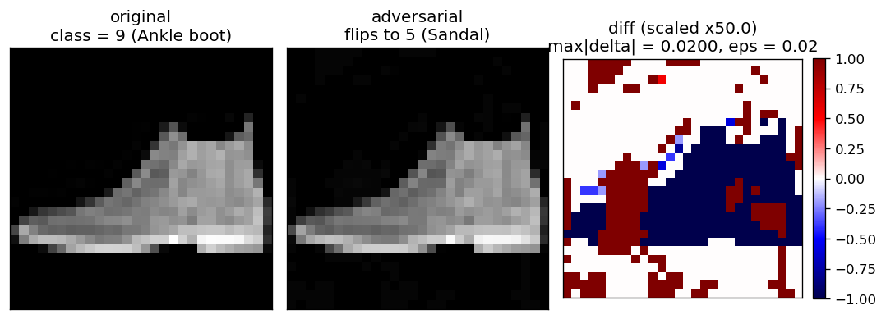

# Assignment 3 — Verifying a FashionMNIST MLP with Marabou

This directory contains the implementation for Problem 2: training a small
external model (a 3-layer MLP on FashionMNIST) and verifying its
L-infinity robustness with [Marabou](https://github.com/NeuralNetworkVerification/Marabou).

## Files

| File | Purpose |
|------|---------|
| `train.py` | Trains the MLP on FashionMNIST and exports it to ONNX. |
| `test.py`  | Loads the ONNX model, formulates the L-infinity robustness query, and runs Marabou for several perturbation radii. |
| `models/fashion_mlp.onnx` | The trained network (input to Marabou). |
| `requirements.txt` | Python dependencies. |
| `problem1_resources_summary.txt` | Exploration notes for Problem 1. |

## 1. Install Marabou

Marabou is built from source. From the parent of this directory:

```bash
git clone https://github.com/NeuralNetworkVerification/Marabou.git
cd Marabou
mkdir build && cd build
cmake .. -DBUILD_PYTHON=ON
cmake --build . -j
```

After the build, `Marabou/maraboupy/MarabouCore.cpython-*.so` should exist.

## 2. Install Python dependencies

```bash
pip install -r requirements.txt
```

## 3. Train the model

```bash
python3 train.py --epochs 3
# -> writes models/fashion_mlp.onnx
```

Training uses CUDA if available, otherwise CPU. ~3 epochs gives ~83% test
accuracy, which is sufficient for the verification experiments.

## 4. Run the verification

```bash
LD_PRELOAD=/usr/lib/x86_64-linux-gnu/libstdc++.so.6 \
    python3 test.py --epsilons 0.001 0.005 0.01 0.02 0.05 --timeout 120
```

`LD_PRELOAD` is only needed if the Python you are using ships an older
`libstdc++` than the one Marabou was compiled against (e.g. Anaconda). On
a standard system Python it can be omitted.

`test.py` accepts:

* `--index N`        index into the FashionMNIST test set (default 0)
* `--epsilons ...`   list of L-infinity radii to verify
* `--timeout S`      per-target Marabou timeout in seconds
* `--onnx PATH`      path to the ONNX model (default `models/fashion_mlp.onnx`)
* `--output-dir D`   directory for `summary.json`, `log.txt`, and any
                     adversarial `.npy` / `.png` artefacts (default `results/`)

For each `eps`, the script asks Marabou whether some other class can
beat the original predicted class inside the L-infinity ball. SAT means
an adversarial example exists; UNSAT means the model is verified robust
at that radius.

Per run, `--output-dir` is populated with:

* `summary.json` — per-eps verdict, total time, full per-target detail,
  and (when SAT) the path of the saved counterexample.
* `log.txt` — full mirror of stdout.
* `adv_eps<value>.npy` — raw 784-d adversarial input found by Marabou.
* `adv_eps<value>.png` — three-panel visualisation: original image,
  adversarial image, and amplified pixel-wise difference.

## Reference results

Test image index 0 (true label "Ankle boot", model also predicts
"Ankle boot"):

| eps    | verdict      | total time | notes                              |
|--------|--------------|-----------:|------------------------------------|
| 0.001  | robust       |    0.33 s  | all 9 targets UNSAT                |
| 0.005  | robust       |    0.42 s  |                                    |
| 0.010  | robust       |    0.40 s  |                                    |
| 0.020  | **not robust** | 0.36 s   | SAT: prediction flips to "Sandal"  |
| 0.050  | **not robust** | 0.44 s   | SAT (early termination on Sandal)  |

Counterexample at eps = 0.020 (saved automatically by `test.py`):



Left: original input, predicted "Ankle boot". Middle: Marabou's
counterexample inside the L-infinity ball of radius 0.02, which the
network now classifies as "Sandal". Right: the per-pixel perturbation,
amplified for visibility — every pixel stays within ±0.02 of the
original.
